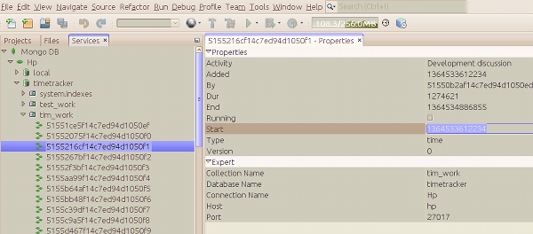

NetBeans MongoDB
================

A [NetBeans](http://netbeans.org) plugin for browsing [MongoDB](http://mongodb.org).  It adds
a node to the Services tab.  Right click it to add servers.

You can browse into collections;  responses to queries are browsable as subnodes;  the property sheet
shows all non-Map, non-List properties (lists and Maps become additional subnodes).

Status
------

Stable and works.

Note that as yet there is no write support, just browsing.

Build And Run / Downloads
-------------------------

It's a Maven project built using the NBM Maven Plugin - just check out and build.

A continuous build of it, with download, exists [on timboudreau.com](http://timboudreau.com/builds/job/netbeans-mongodb/).  To install in NetBeans, simply download and install using Tools | Plugins on the Downloaded tab.

License
-------

MIT license

